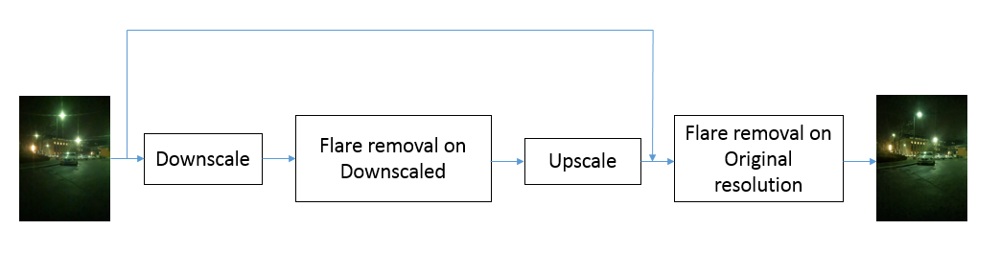
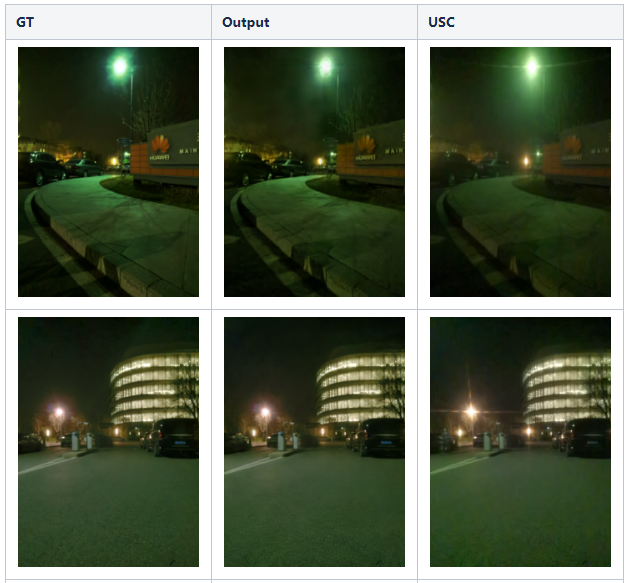

# **Deep feature image enhancement solution**

## Motivation
Main problems with flare removal for capturing pipeline now are large flares and long tails removal. It is difficult to remove such artifacts because of a very high input image resolution (2448x3264) and limited CNN receptive field (not usually more than 512x512)

## Solution description
In order to solve this issue new architecture was proposed: 

Main idea is to increase receptive field against large flares and long tails by following actions:

1. Train flare removal on downscaled images (8x) and using CNN with high receptive field (autoenc from DeRain net)

2. Use upscaled output of flare removal on downscaled images as a guidance for full res flare removal

Solution effectively removes long tails and also removes small flare like LED etc. Solution is based on the architecture af the autoencoder from the "Attentive Generative Adversarial Network for Raindrop Removal from A Single Image" by Rui Qian et al. Such architecture provides a good temporal consistency in case of video application. 

The best results can be obtained by training the solution with rich and diverse dataset or using various augmentations such as zoom, rotate, shear, HSV variation etc. Solution fits relatively quickly (less then 1000 epoch sometimes) and tend to overfitting, so long training is not recommended. Solution is promising for detail restoration and noise removal as well as fullres part does not have a big load from high level artifact removal. 